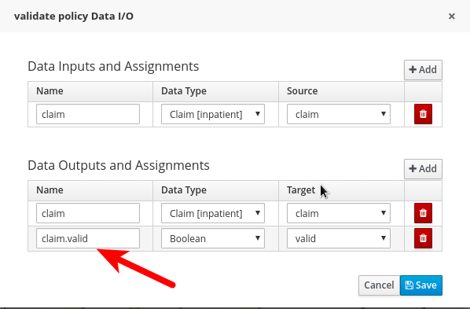

Coding Tips
===========

## MVEL
http://mvel.documentnode.com/

## Variable substitution

There are many place where you can place MVEL expressions.
For example in human task subject field:

    #{varible}

## Variable

    kcontext.setVariable("list",list);

## On exit

    System.out.println(">>> exit: " + kcontext.getNodeInstance().getNodeName());

## Variable Mapping at assignment level

The task assignments are able to perform variable mapping using the MVEL notation.

E.g.:

 
## Get/Set variable by code

The following interface provides the full access to the variable:

    org.kie.api.runtime.process.WorkflowProcessInstance

This is a code sample:

	WorkflowProcessInstance processInstance = (WorkflowProcessInstance) runtimeEngine.getKieSession().getProcessInstance(processInstanceId);
	processInstance.getVariable(name);
	processInstance.setVariable(name, value);

## Debugging process

Add this event Listener:
org.drools.core.event.DebugProcessEventListener

## XStream utility

Constructor

	XStream xStream = new XStream();
	xStream.fromXML(xml, this);

String

	public String toString() {
		XStream xStream = new XStream();
		return xStream.toXML(this);
	}

## EJB client

	<properties>
		<version.bpms>6.4.0.Final-redhat-6</version.bpms>
	</properties>

(...)
	
		<dependency>
			<groupId>org.jbpm</groupId>
			<artifactId>jbpm-services-ejb-client</artifactId>
			<version>${bpm.version}</version>
			<scope>runtime</scope>
		</dependency>

## Multi thread tolerance

During the development of BRMS 6.3 and 6.4, the engine was redesigned to better coordinate different threads (both created by user and internal to the engine itself) accessing a KieSession. In particular, they simplified the concurrency model of the engine, with the introduction of that state machine, and this allow to both increase performances in multithreaded environments and be more confident about the robustness of the engine in heavily concurrent use cases.

KieBase and KieSession have been designed to be thread-safe.
Dynamic changes to a KieBase are now coordinated with the state machines of the KieSessions formerly created by the same KieBase, so also incremental compilation can be considered thread-safe.

KieSessions can be shared between different threads.

It's better to avoid the execution of long and blocking operations inside the RHS but this is not related with thread-safety. This only related to performance reasons, because also the invocation of a RHS is blocking and synchronous, so having a particularly slow RHS will have the effect of slowing down the whole engine.

KieSession is single threaded (v7 introduces multi-threading capabilities). So any blocking operation in the RHS blocks the full session and all the rule evaluation in that session. So blocking operations in the RHS essentially kills performance of your rules engine.