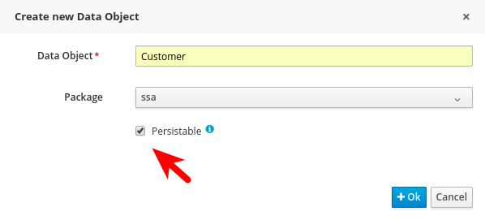
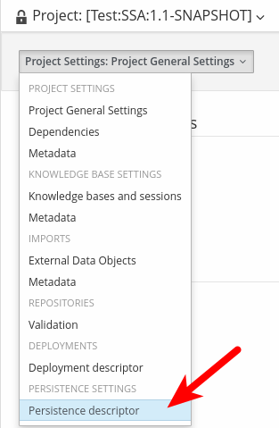
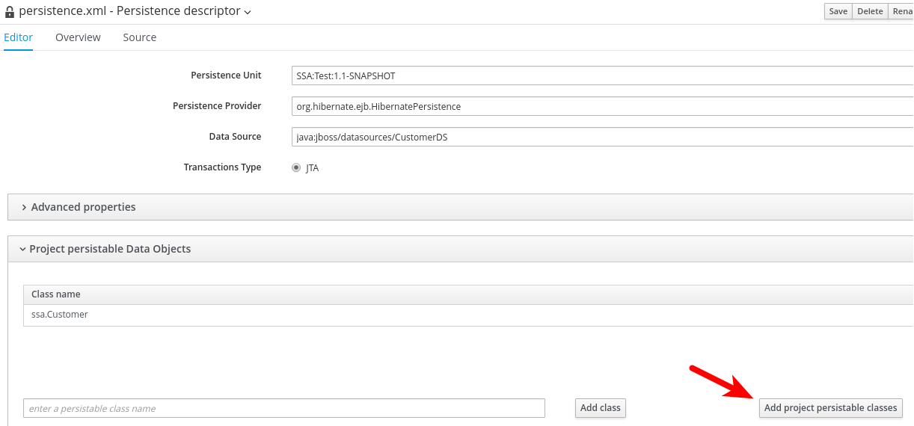

# Asynchronous Jobs

Some findings:

1. If you specify "Is Async" for a task, it is executed in another thread by the executor
2. if the service get an runtime exception the executor repeat the execution for 3 times, then it puts the job in error state
3. in the Jobs page (Deploy > Jobs), you can find the job in the error tab.
4. the user can requeue the job, so the executor tries again the job execution.
5. from the Jobs page, you can stop and start the Executor, change the frequency and the threads (I think that it is implemented with a polling logic over the DB)
6. If I stop the executor and launch a new process, for some strange reason the job is executed (regardless the executor stop status!) but if the service raise an exception, it is marked as "retrying" and is not processed again till the executor is started again

# Asynchronous Workitems

http://mswiderski.blogspot.it/2013/08/make-your-work-asynchronous.html

A process can have two kinds of asynchronous tasks:
Task with the "Is Async" property set to true - this generates a proxy called "AsyncSignalEventCommand" (an asynchronous job) that is charge to execute the task. In this case, when the job is executed the actual process instance variables are retrieved and passed to the synchronous WorkItemHandler implementation.
Task with an [AsyncWorkItemHandler][1] Implementation (or the command pattern) - in this case an asynchronous job is generated with the input payload serialized at creation time. When the job is executed the payload is always the same regardless the actual values of process variables.

# Executor configuration
Executor can work with or without JMS.
JMS is the preferred option but executor can work without it and it does for instance on Tomcat where there is no JMS provider out of the box.
you can disable JMS executor by system property `org.kie.executor.jms=false`

# Deployment Descriptor

While kmodule is mainly targeting on knowledge base and knowledge session basic configuration, deployment descriptors are considered more technical configuration. Following are the items available for configuration via deployment descriptors:

  * persistence unit name for runtime data
  * persistence unit for audit data
  * persistence mode (JPA or NONE)
  * audit mode (JPA, JMS, NONE)
  * runtime strategy (SINGLETON, PER_REQUEST, PER_PROCESS_INSTANCE)
  * list of event listeners to be registered
  * list of task event listeners to be registered
  * list of work item handlers to be registered
  * list of globals to be registered
  * marshalling strategies to be registered (for pluggable variable persistence)
  * required roles to be granted access to resources of the kjar
  * additional configuration options of knowledge session
  * additional environment entries for knowledge session
  * list of fully qualified class names that shall be added to the classes used for serialization by remote services
  * whether or not to limit the classes from the deployment used for serialization by the remote services

[https://docs.jboss.org/jbpm/release/6.5.0.Final/jbpm-docs/html/ch14.html#d0e15405]()

# Custom variable persistence

It is possible store the process variable in a DBMS table.
In order to achieve this result, you have to configure the *Data Object* as *Persistable*.

Then you have to configure the *Persistence descriptor*:

1. From the **Project Settings** open the *Persistence descriptor*.

    

2. Add all *Project persistable classes* to the persistence descriptor

    

3. By default the new persistence unit points to the same BPM datasource, this means that the table will be created in the same DB of the BPM engine. In order to separate the process specific information from the BPM engine ones, it's a good practice to define a new datasource targeting a different DB. The drawback of the latter configuration is that the BPM datasource and the new one must be XA compliant, with the performance implication that a distributed transaction brings on the table.

# Task does not allow multiple incoming sequence flow (uncontrolled flow)

According to BPMN 2.0 specification allows on page 153 multiple incoming flow sequences for activities (i.e. also for tasks). jBPM fails to validate such an BPMN file. It throws an IllegalArgumentException with the message This type of node cannot have more than one incoming connection!.

Multiple incoming and outgoing sequence flows will be accepted in the jBPM Web Designer and by the jBPM6 Engine after adding the system property `jbpm.enable.multi.con=true` while starting BPMS/BRMS server.

[https://access.redhat.com/solutions/779893]()

[1]: https://github.com/droolsjbpm/jbpm/blob/master/jbpm-services/jbpm-executor/src/main/java/org/jbpm/executor/impl/wih/AsyncWorkItemHandler.java

# Issues

## PerProcessInstanceRuntimeManager

https://access.redhat.com/solutions/1183403