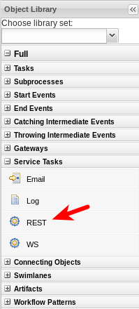
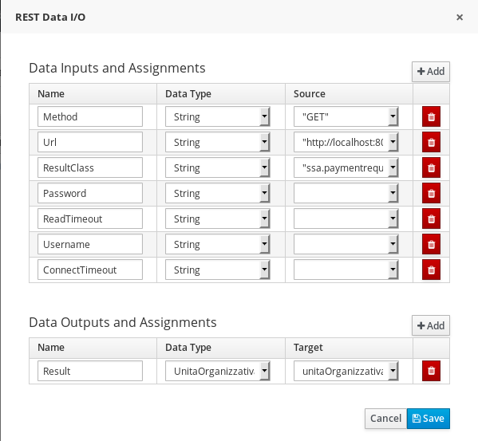

# Call REST service

Use the REST Workitem

Configure the assignment (Data I/O):

- Method: GET, PUT, POST, DELETE
- URL: URL to rest service
- ResultClass: fully qualified Class name of the DTO
- Result: the target DTO

**DTO** stands for *Data Transfer Object*: a Java Object that will be used to map the data send from and by the rest service.

If you want disregard some json properties, add the following annotation to the Java DTO:

    @org.codehaus.jackson.annotate.JsonIgnoreProperties(ignoreUnknown = true)

This will say to the JSON mapper engine to ignore the JSON properties that are not present in the DTO, otherwise you'll get an exception.

## Dealing with the Content Type header property
Usually, REST service should declare how they serialize the data through the Header property `Content-Type` that in most case will assume the following values:

- `application/json`
- `application/xml`

Some REST services return a more complex Content-Type to add more details.

E.g. `Content-Type: application/json;charset=utf-8`

Unfortunately, the standard REST Workitem handler (WIH) is not able to handle this situation.
Here you will found a modified version of the WIH that address the problem.

[Improved REST WIH](./samples/wih/rest-wih/README.md)

