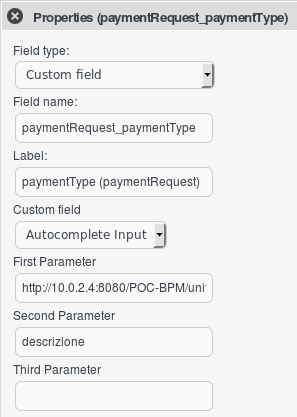

# Autocomplete Input Field

## Installation

build it and place in the business central lib folder

## Usage

1. Insert a field in the form that you want to handle with the autocomplete
2. Open the Properties pane (Click edit in the field tooltip)  
	
3. In `Field type` list, select `Custom field`
4. As `Custom field` select `Autocomplete Input`
5. As `First Parameter` insert the Rest Service URL
6. The `Second Parameter` is optional, you can use it if the Rest Service returns a list of object, here you can place the object field name that you want to use to populate the suggestion list.
 
**Note:** if you fill the `Second Parameter` the list is filtered using the typed term. E.g. Typed term: 'aa', Rest response 'abb', 'aab', 'aac', the suggestion list is narrowed to 'aab', 'aab'

##Information about the REST service implementation
The ideal rest service should replies a pre filtered list of suggested options using the query parameter `term`, if it's not the case the filtering will be done on client side. 

The filtering logic is in the javascript code of the `input.flt` file, and specifically:

		  var listOfValues =[];
		  for( var i in data ) {
			if (data[i].hasOwnProperty("${property}")) {
			  value = data[i].${property};
			  if (value.indexOf(term) > -1)
			    listOfValues.push(value);
			}
		  }

You can change this logic to adapt to specific needs.