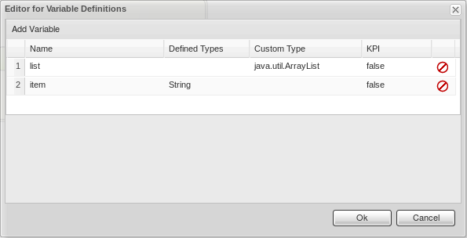
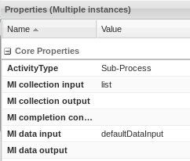

# Subprocesses

## Multiple instance

This construct is really useful to model a repeatable logic that should iterate over a bunch of values (a list). Let's look at this simple process:

Here the variables:

The init task initialize the list:

    System.out.println("init " + list);

    list = new java.util.ArrayList<String>();
    list.add("str1");
    list.add("str2");
    list.add("str3");

    kcontext.setVariable("list",list);

Let's see how to configure the multiple instance node:

**Note** for a bug MI data input is not editable. After a save the editor automatically set it to `defaultDataInput`.

Inside the script node you can access to the variable of that iteration, here the code:

    System.out.println("log: "+ defaultDataInput);

Run the process and you'll see the following log output:

    20:07:53,653 INFO  [stdout] (http-127.0.0.1:8080-1) init null
    20:07:53,664 INFO  [stdout] (http-127.0.0.1:8080-1) log: str1
    20:07:53,675 INFO  [stdout] (http-127.0.0.1:8080-1) log: str2
    20:07:53,681 INFO  [stdout] (http-127.0.0.1:8080-1) log: str3

It work as designed!

### Reference
[http://mswiderski.blogspot.it/2015/01/multiinstance-characteristic-example.html]()

###Glitch found

For some strange reason if you don't specify a form, BPMS autogenerate it for you. It can be useful in some cases, but in this example it initiate `init` as `String` with unexpected cast exception at runtime. You can work around this generating a void start form for the process!
